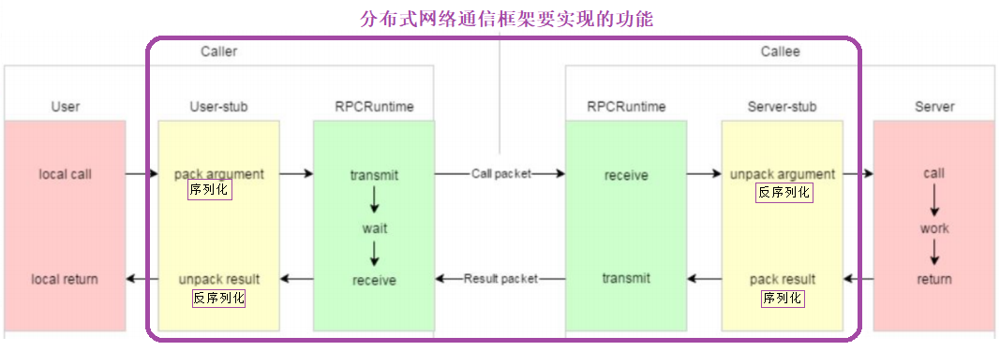
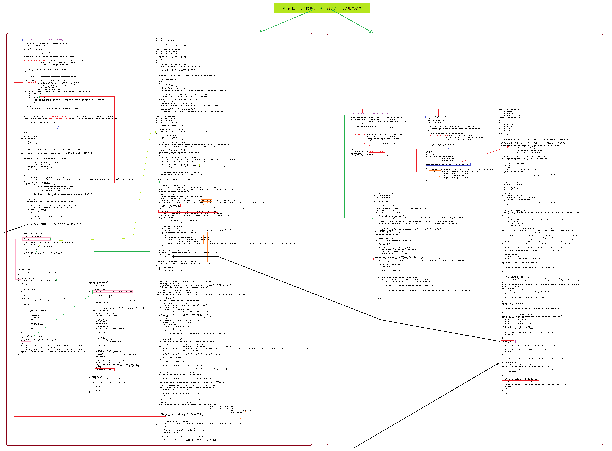
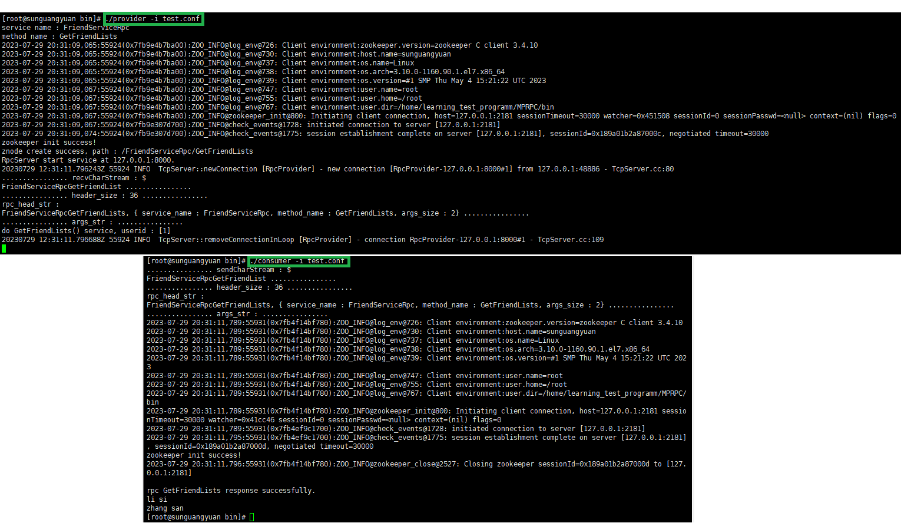
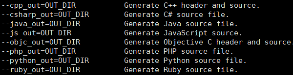
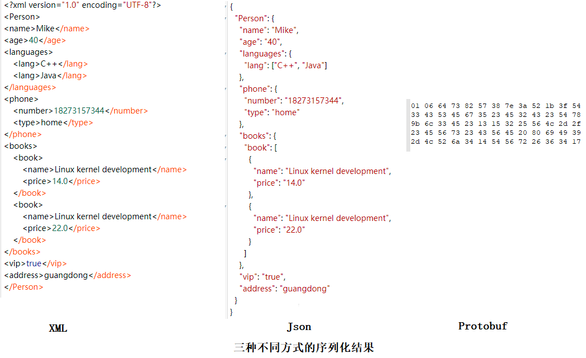
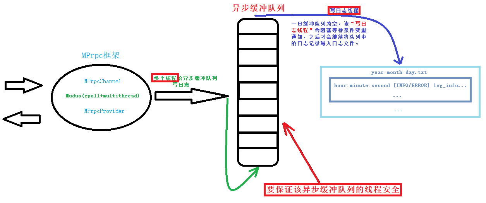
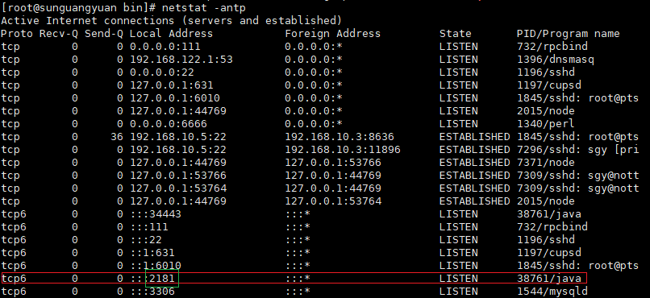
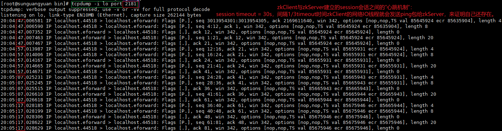
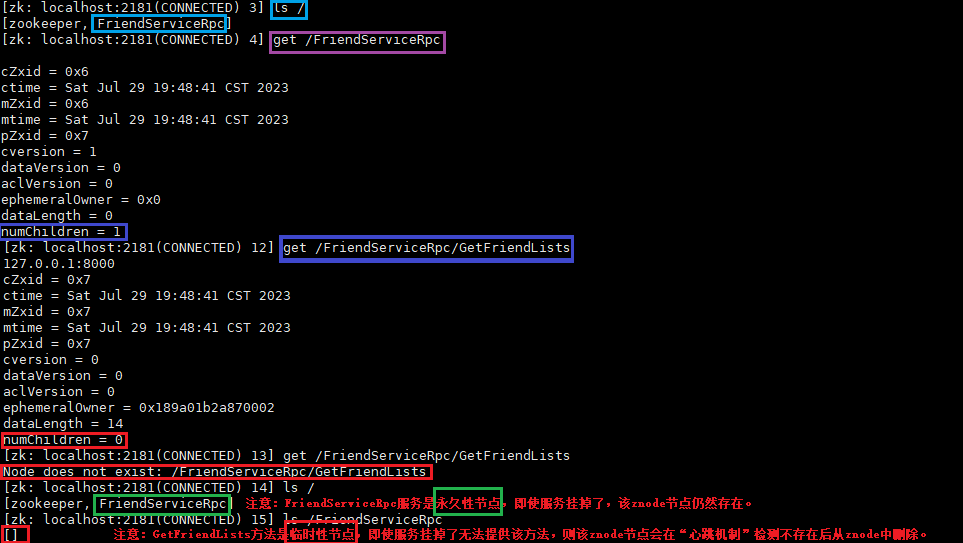
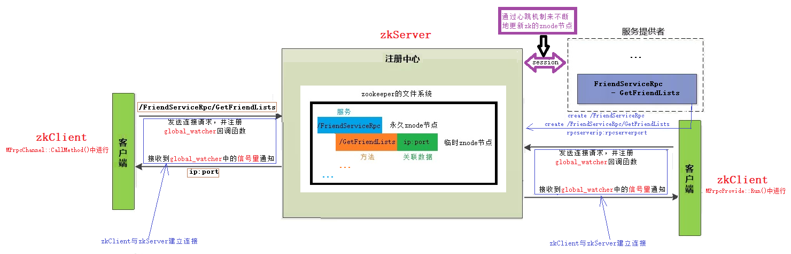

# MPrpc-basedon-Muduo-Protobuf
本项目通过`Muduo`网络库和`Protobuf`传输协议、`zookeeper`服务协调中心，实现了分布式系统中的`MPrpc`远程调用框架，使用者可以通过简单的定义`callee`和`caller`中的方法、`bin/test.conf`配置文件中`zookeeper`的`host`地址和`rpcserver`的`host`地址，来实现服务的发布和远程调用。同时，通过异步日志缓冲队列，可实现MPrpc框架在使用过程中的日志记录。

[分布式 `MPrpc` 网络通信框架，万字详细分析。](https://blog.csdn.net/qq_44599368/article/details/132005866?spm=1001.2014.3001.5501)

# 技术栈：

1. 集群和分布式概念以及原理。
2. `RPC` 远程过程调用原理以及实现。
3. `Protobuf` 数据序列化和反序列化协议。
4. `ZooKeeper` 分布式一致性协调服务应用以及编程。
5. [`muduo` 网络库编程。](https://blog.csdn.net/qq_44599368/article/details/131833423?spm=1001.2014.3001.5501)
6. 异步日志缓冲队列，实现了日志系统设计。
7. [`CMake` 构建项目集成编译环境](https://blog.csdn.net/qq_44599368/article/details/131929941?spm=1001.2014.3001.5501)。

# 项目的环境配置与编译：

需要按照后文所说的，先安装配置`muduo`、`protobuf`和`zookeeper`，之后可运行`./autobuild.sh`一键编译。

考虑到自己的虚拟机配置的`muduo`静态库，故本项目生成的`MPrpc`库也为静态库（否则会报链接失败的错误）。好处在于，该项目的部署移植到其他的linux服务器上，则不需要再考虑额外的配置`muduo`环境，因其已被加载进了本项目生成的`libmprpc.a`静态库中。

# `MPrpc` 框架的通信原理：
## `MPrpc` 框架的时序图：


## `RPC`通信原理：

`RPC`（`Remote Procedure Call`）***远程过程调用**。



黄色部分：设计 `rpc` 方法参数的打包和解析即数据的序列化和反序列化，使用 `Protobuf`。

绿色部分：网络部分，包括寻找 rpc 服务主机，发起 rpc 调用请求和响应 rpc 调用结果，使用 muduo 网络库和 zookeeper 服务配置中心（专门做服务发现）。


## 调用过程图：



# 项目验证：




# `protobuf` 的使用：
## 介绍：

`protobuf`（`protocol buffer`）是 google 的一种数据交换的格式，提供了 `protobuf` 多种语言的实现：java、c#、c++、go 和 python，每一种实现都包含了相应语言的编译器以及库文件。



它是一种效率和兼容性都很优秀的**二进制数据传输格式**，<u>比使用文本存储的 xml（20倍） 、json（10倍）进行数据交换快许多</u>，可用于**<u>分布式应用之间的数据通信**、异构环境下的数据交换</u>。

[本图片的出处：](https://blog.csdn.net/Jiangtagong/article/details/119656782)

`protobuf`采用二进制编码，而`xml`和`json`采用文本文件编码，故`protobuf`效率更高。



## 安装配置：

```shell
# 解压压缩包
unzip protobuf-master.zip
cd ./protobuf-master

# 自动生成configure配置文件
./autogen.sh

# 配置环境
./configure

# 编译源代码（时间比较长）
make
# 安装
sudo make install

# 刷新动态库
sudo ldconfig
```

熟悉 `Protobuf` 的 `proto` 配置文件内容，以及 `protoc` 的编译命令。

## 定义整个框架的传输协议：

定义了整个框架的传输协议，即相互之间传递信息的格式：

`header_size（占4bytes） + header_str:{service_name、method_name、args_size} + args`。

`RpcHeader.proto`：

```protobuf
syntax = "proto3";

package mprpc;

message RpcHeader           
{
    bytes service_name = 1;   // 类名
    bytes method_name = 2;    // 方法名
    uint32 args_size = 3;     // 参数大小
}
```

## 定义描述`rpc`方法的类型：

要使用 `mprpc` 一般都是在`example/callee/` 和 `example/caller/` 目录下定义服务方法提供者和调用者，故需要在`exampel/` 目录下定义服务请求、响应和方法信息在 `***.proto` 文件中。


`user.proto`：编译后会产生 `user.pb.cc` 和 `user.pb.h` 两个文件。

```cpp
// 产生的 `user.pb.cc` 和 `user.pb.h` 文件中，最主要的就是包含了如下五个重要的类定义！！！
class LoginRequest : public ::google::protobuf::Message
{
    id();
    set_id();
    pwd();
    set_pwd();
}
class LoginResponse : public ::google::protobuf::Message   
{
    success();
    set_success();
}
class SignupRequest : public ::google::protobuf::Message
{
    name();
    set_name()
    pwd();
    set_pwd();   
}
class SignupResponse : public ::google::protobuf::Message
{
    success();
    set_success();    
}

// 最重要的类!!!
class UserServiceRpc : public ::google::protobuf::Service   
{
    ...
    void Login(::google::protobuf::RpcController* controller,
                const ::ik::LoginRequest* request,
                ::ik::LoginResponse* response,
                ::google::protobuf::Closure* done)
    {
        channel_->CallMethod(descriptor()->method(0), controller, request, response, done);
    }
    void Signup(::google::protobuf::RpcController* controller,
                const ::ik::RegisterRequest* request,
                ::ik::RegisterResponse* response,
                ::google::protobuf::Closure* done)
    {
        channel_->CallMethod(descriptor()->method(1), controller, request, response, done);
    }
    ...
}
```

```protobuf
syntax = "proto3";

package fixbug;

// 下面的选项，表示生成service服务类和rpc方法描述（默认不会生成）
option cc_generic_services = true;

message ResultCode
{
    int32 errcode = 1;
    bytes errmsg = 2;
}

message LoginRequest   
// message LoginRequest <==> class LoginRequest : public ::google::protobuf::Message
{
    uint32 id = 1;
    bytes pwd = 2;
}

message LoginResponse  
// message LoginResponse <==> class LoginResponse : public ::google::protobuf::Message
{
    ResultCode result = 1;
    bool success = 2;
}

message SignupRequest   
// message SignupRequest <==> class SignupRequest : public ::google::protobuf::Message
{
    bytes name = 1;
    bytes pwd = 2;
}

message SignupResponse  
// message SignupResponse <==> class SignupResponse : public ::google::protobuf::Message
{
    ResultCode result = 1;
    bool success = 2;
}

service UserServiceRpc  
// service UserServiceRpc <==> class UserServiceRpc : public ::google::protobuf::Service
{
    rpc Login(LoginRequest) returns(LoginResponse);
    rpc Signup(SignupRequest) returns(SignupResponse);
}

// 注意：protobuf只提供了对rpc方法的描述，并不提供rpc功能
//，即protobuf中只是定义了rpc方法的定义/调用规范并没有具体的实现。
```

`friend.proto`：编译后会产生 `friend.pb.cc` 和 `friend.pb.h` 两个文件。

```cpp
// 产生的 `user.pb.cc` 和 `user.pb.h` 文件中，最主要的就是包含了如下五个重要的类定义！！！
class ResultCode : public ::google::protobuf::Message
{
    errcode();
    set_errcode();
    errmsg();
    set_errmsg();    
}
class GetFriendListsRequest : public ::google::protobuf::Message
{
    userid();
    set_userid();    
}
class GetFriendListsResponse : public ::google::protobuf::Message    
{
    set_friendlists();
    add_friendlists();
}

// 最重要的类!!!
class FriendServiceRpc : public ::google::protobuf::Service   
{
    ...
    void GetFriendLists(::google::protobuf::RpcController* controller,
                const ::ik::LoginRequest* request,
                ::ik::LoginResponse* response,
                ::google::protobuf::Closure* done)
    {
        channel_->CallMethod(descriptor()->method(0), controller, request, response, done);
    }
    ...
}
```

```protobuf
syntax = "proto3";

package fixbug;

// 下面的选项，表示生成service服务类和rpc方法描述（默认不会生成）
option cc_generic_services = true;

message ResultCode        
// message ResultCode <==> class ResultCode : public ::google::protobuf::Message
{
    int32 errcode = 1;   
    bytes errmsg = 2;     
}

message GetFriendListsRequest  
// message GetFriendListsRequest <==> class GetFriendListsRequest : public ::google::protobuf::Message
{
    uint32 userid = 1;
}

message GetFriendListsResponse   
// message GetFriendListsResponse <==> class GetFriendListsResponse : public ::google::protobuf::Message
{
    ResultCode result = 1;
    repeated bytes friendlists = 2;
}

service FriendServiceRpc    
// service FriendServiceRpc <==> class FriendServiceRpc : public ::google::protobuf::Service
{
    rpc GetFriendLists(GetFriendListsRequest) returns(GetFriendListsResponse);
}
// 注意：protobuf只提供了对rpc方法的描述，并不提供rpc功能
//，即protobuf中只是定义了rpc方法的定义/调用规范并没有具体的实现。
```

# 日志系统的设计：


将日志信息写入 `queue`队列中（前提是保证队列的线程安全），之后 <u>**“写日志线程”** 将队列中的日志写入文件</u>中。



注意：当queue队列为空时，为了不影响 `mprpc` 框架中的 `epoll + multithread` 的效率，避免出现写日志线程一直占有锁导致主线程无法给队列写日志而阻塞，则需要<u> **“框架中的多线程”** 与 **“写日志线程”** 进行通信</u>，即<u>只有队列不用空时 “写日志线程才 能抢占锁</u>。


# zookeeper的使用：

## 安装与配置：

注意：默认 `zookeeper` 的工作端口为 `2181`。

```shell
cd /opt
tar -zxvf ./zookeeper-3.4.10.tar.gzd
cd ./zookeeper-3.4.10

vim ./conf/zoo.cfg
    # 修改配置文件中的该项配置：
    # the directory where the snapshot is stored.
    # do not use /tmp for storage, /tmp here is just 
    # example sakes.
    dataDir=/var/zookeeper-3.4.10/data   # 记录zookeeper中的数据，避免重启后的丢失

# 运行zookeeper需要先配置Java开发环境
yum install java-1.8.0-openjdk java-1.8.0-openjdk-devel -y
vim /etc/profile  # 添加下面两行环境变量
	JAVA_HOME=/usr/lib/jvm/java-1.8.0-openjdk-1.8.0
	PATH=$PATH:$JAVA_HOME/bin    # 将java可执行文件的目录($JAVA_HOME/bin)添加到PATH
source /etc/profile
java -version   # 验证java环境是否配置成功

cd ./bin
 # Uasge : ./zkServer.sh {start|start-foreground|stop|restart|status|upgrade|print-cmd}
./zkServer.sh start

# 验证zkServer的状态
netstat -antp 
```



```shell
# 启动zookeeper的客户端
cd ./bin
./zkCli.sh

# zk客户端常用命令
ls、get、create、set、delete
```

## zookeeper的原生开发API（c/c++接口）：

主要关注zookeeper怎么管理节点，zk-c API怎么创建节点，获取节点，删除节点以及watcher机制的API编程。

```shell
cd /opt/zookeeper-3.4.10/src/c

# zookeeper已经提供了原生的C/C++和Java API开发接口，需要通过源码编译生成，过程如下：
su root
./configure
make
make install  
# 会产生两个版本的so库：libzookeeper_mt多线程版本、libzookeeper_st单线程版本。

# 刷新链接库的缓存
ldconfig 
```
zookeeper原生提供了C和Java的客户端编程接口，但是使用起来相对复杂，几个要点：

1. 源码上，`session timeout=30s`，即在1/3的Timeout时间`zkClient`的网络IO线程会发送ping心跳消息给`zkServer`，接收到响应后会重置`session timeout=30s`并重新开始该心跳过程，以此`zkClient`证明了自己还存在。

   

   一旦超过`session timeout`时间`zkServer`仍未收到来自`zkClient`的心跳包，则证明服务已经下线，则zookeeper`自动删除对应的`znode`临时节点，即就无法再通过zookeeper找到该服务的`host=ip:port`。

   

2. 设置监听 `watcher` 只能是一次性的，每次触发后需要重复设置。

3. `znode` 节点只存储简单的`byte`字节数组，如果存储对象，需要自己转换对象生成字节数组。（本项目只在`znode`节点存储`ip`和`port`，故不会涉及该问题）

## 本项目zookeeper作为服务注册中心：

zookeeper起到了<u>分布式应用的一致性协调作用，用于服务的注册和发现</u>，即`分布式服务的注册中心`。


